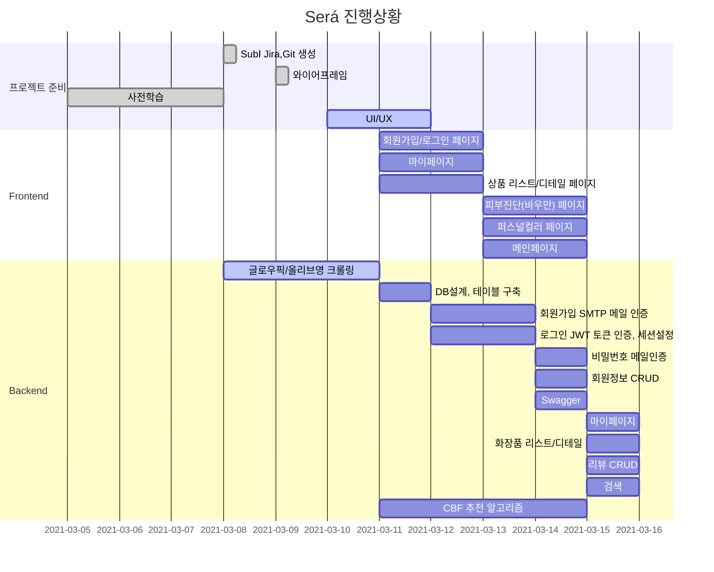

# 💄SUBPJT 2 : 기본 추천 시스템 구현

> 주제: Será - 화장품 추천 서비스
> 팀명: 2조(B202) 

[SubPJT2 노션 문서](https://www.notion.so/_sub2-4acb788881b04c9e8f218912fda101c8)

##  팀원 역할

| 팀원   | 역할 | 비고                                          |
| ------ | ---- | --------------------------------------------- |
| 김지형 | 팀장 | 프론트엔드 개발, GIT마스터, 화면정의서        |
| 백정현 | 팀원 | 백엔드 개발, QA(Jira관리), 로고 디자인        |
| 유진이 | 팀원 | 풀스택 개발, QA(Jira관리), UX/UI 디자인       |
| 정다운 | 팀원 | 프론트엔드 테크리더, 화면정의서, UX/UI 디자인 |
| 정혜지 | 팀원 | 백엔드 테크리더, 화면정의서                   |

##  기술 스택

  

      

## Gantt Chart

## Branch 규칙

## Code Style

## 기능

## 산출물

### ERD

### 화면 정의서

### 와이어프레임

