# 💄SUBPJT 2 : 기본 추천 시스템 구현

> 주제: Será - 화장품 추천 서비스
> 팀명: 2조(B202) 

[SubPJT2 노션 문서](https://www.notion.so/_sub2-4acb788881b04c9e8f218912fda101c8)


##  팀원 역할

| 팀원   | 역할 | 비고                                          |
| ------ | ---- | --------------------------------------------- |
| 김지형 | 팀장 | 프론트엔드 개발, GIT마스터, 화면정의서        |
| 백정현 | 팀원 | 백엔드 개발, QA(Jira관리), 로고 디자인        |
| 유진이 | 팀원 | 풀스택 개발, QA(Jira관리), UX/UI 디자인       |
| 정다운 | 팀원 | 프론트엔드 테크리더, 화면정의서, UX/UI 디자인 |
| 정혜지 | 팀원 | 백엔드 테크리더, 화면정의서                   |


##  기술 스택

  

    


## Gantt Chart

```mermaid
gantt
    title Será 진행상황
    dateFormat  YYYY-MM-DD
    section 프로젝트 준비
    SubⅠ Jira,Git 생성  :done, 2021-03-08, 6h
    와이어프레임 : done, 2021-03-09, 6h
    사전학습   :done, 2021-03-05, 3d
    UI/UX   : done,   2021-03-10, 2d
    발표 PPT 제작: done, t8, 2021-03-16, 3d
    발표 준비 : done,t9, after t8, 1d
    Sub2 발표 : done, t10, 2021-03-19, 1d
    추가 UI/UX(메인,피부진단,퍼스널컬러): done, 2021-03-19, 5d
    테스트 시나리오 작성 : active, t14, 2021-03-25, 1d
    와이어프레임 산출물 제작 :  active, t15, 2021-03-25, 1d
    SUB3 중간 발표 PPT 제작 : active, t16, 2021-03-24, 2d
    SUB3 중간 발표 : active, t17, 2021-03-26, 1d


    section Frontend
   	회원가입/로그인/비밀번호찾기 페이지 :  done, t1, 2021-03-14, 2d
   	마이페이지 :  done, t2, 2021-03-14, 2d
   	상품 리스트/디테일 페이지  : crit, t3, 2021-03-22, 4d
    회원가입/로그인/비밀번호찾기 api 연동 : done, t4, after t1,2d
    공통 컴포넌트 UI : done, t7, 2021-03-16, 1d
    마이페이지 api 연동: done, t5, 2021-03-18, 1d
    Redux : done, t6, 2021-03-17, 1d
  	검색결과 페이지 : done, t11, 2021-03-18, 1d
  	찜 목록 페이지 : done, t12, 2021-03-18, 1d
  	메인화면: active, t13, 2021-03-25, 1d
	마이페이지 피부진단 UI : crit, t17, 2021-03-24, 1d
	마이페이지 퍼스널컬러 UI : crit, t18, 2021-03-24, 1d
	로그인 리덕스 연결 : crit t19, 2021-03-24, 1d
    
    section Backend
  	글로우픽 크롤링 : done, b_t1, 2021-03-15, 6d
  	DB설계, 테이블 구축 : done, b_t2, after 2021-03-12, 6h
    회원가입 SMS 인증 : done, b_t4, 2021-03-15, 1d
    로그인 JWT 토큰 인증, 세션설정 : done, b_t5, 2021-03-15, 1d
    비밀번호 SMS 인증 : done, b_t6, 2021-03-16, 1d
    회원정보 CRUD : done, b_t7, 2021-03-15, 1d
    Swagger : done, b_t8, after b_t6, 1d
    CF 추천 알고리즘 : crit, b_t3, 2021-03-14, 11d
    상품 리스트 & 디테일 조회 api (Spring): crit, b_t9, 2021-03-19,6d
    리뷰 CRUD api (Spring): active, b_t10, 2021-03-24, 2d
	상품 검색 api(Spring):  crit,b_t12, 2021-03-19, 8d
    상품 리스트 & 디테일 조회 api (Django): active, b_t11, after b_t3, 1d
    상품 검색 api (Django): active, b_t13, after b_t11, 1d
    AWS 배포: done, b_t13, 2021-03-23, 2d

```



## ✔ Branch 규칙

```bash
develop/feature/기능명
```


## **✔** 커밋 메시지

📌 하나의 기능 완성되면 한번에 커밋

```markdown
> 공통
https://blog.ull.im/engineering/2019/03/10/logs-on-git.html 대로 메시지 
한글 사용하자 :)) 

프론트 : "[Jira issue number]FE_{featureName}_날짜:완성한 기능(작업 부분-폴더명)" 
		ex) FE_0118:피드작성 컴포넌트 추가/수정/삭제 (Feed)

백 : "[Jira issue number]BE_{featureName}_날짜: 완성한 기능(작업 부분-파일명)" 
		ex) BE_0118:피드작성 컴포넌트 추가/수정/삭제 (UserController)

리드미 : "README_날짜: 수정한 부분" 
		ex) README_0118:와이어프레임 수정
```


## ✔ Code Style

| FrontEnd                                                     | BackEnd                                                      |
| ------------------------------------------------------------ | ------------------------------------------------------------ |
| 1. 폴더명: 첫글자 대문자<br />→ ex) Feed/Add.vue <br/><br/>2. 파일명: 첫글자 대문자 <br/> → ex) Add.vue <br/><br/>3. 경로명: 소문자 → ex) /add | 1. 클래스명:  첫글자 대문자 + camel case <br/> ex) MainController.java <br/><br/> 2. 함수, 변수: 첫글자 소문자 + camel case <br/> ex) public void setUserName(); |

- if문

  - 한줄 일 때, Block 처리하기
  - else if / else /중괄호는 조건문 바로 옆에 붙이기

  ```
  if(condition){
   statement;
  } else if(condition2){
   statement2;
  } else{
   statement3;
  }
  ```

- for

  - 단순 반복문은 iterator를 i,j,k,...,z순으로 명명하기

- 주석 상대방이 이해할 수 있도록 달기

  - /**/ 설명 여러줄 필요할 때 코드 위에 작성
  - // 간단한 주석 코드 옆에 작성


## 기능


## 산출물


### ERD


### 화면 정의서


### 와이어프레임


